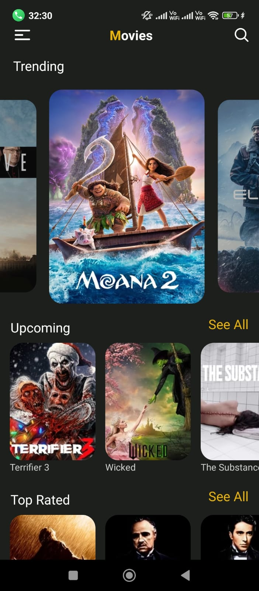
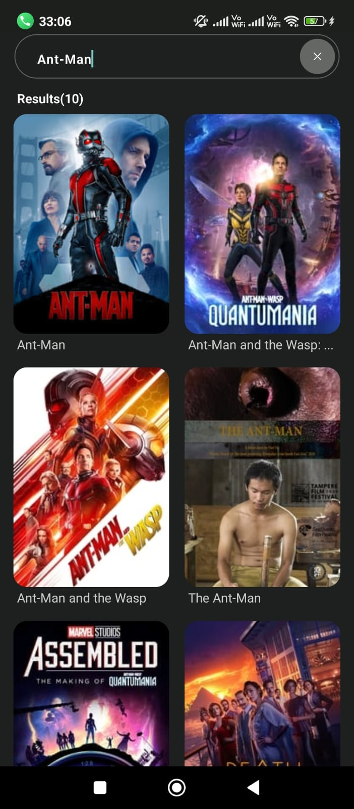
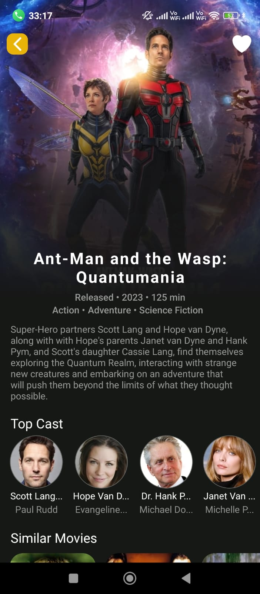
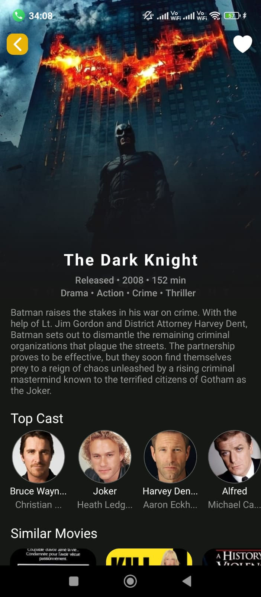
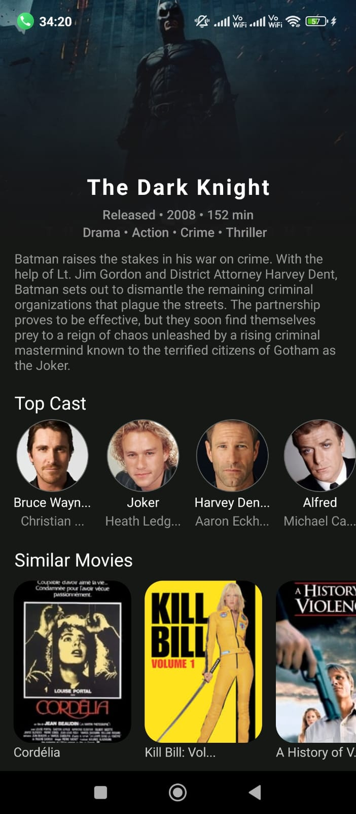

# React Native Movie App

Developed a feature-rich movie application using React Native. The app provides a seamless and immersive experience for cinema enthusiasts, allowing users to explore trending, top-rated, and upcoming movies. It also offers comprehensive movie details and an effortless search experience.

## Key Features
- **Explore Movie Collections**: Browse trending, top-rated, and upcoming movies with ease.
- **Comprehensive Movie Details**: Access detailed information about each film, including cast and crew.
- **Effortless Search**: Quickly search and find your favorite movie titles.

### Screenshots

    
    
    
    
    
    

## Technologies Used
- **Frontend**: React Native (cli)
- **Backend**: API integration with a third-party movie database (e.g., TMDB API)

## Objectives
- Provide an immersive and intuitive experience for movie lovers.
- Offer an easy way to explore movies with rich, detailed content.
- Enable users to search for and discover their favorite movies effortlessly.

## How to Run
1. Clone the repository `git clone https://github.com/Hari2855/Movie_app.git`
2. Install dependencies with `npm install` or `yarn install`.
3. Run the app with `npx react-native run-android`.

This app is designed to deliver a rich, fast, and enjoyable movie discovery experience for all cinema enthusiasts.
